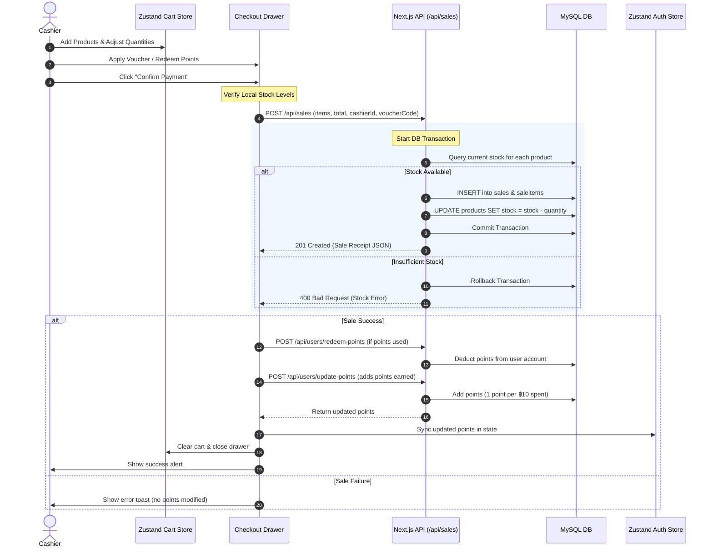

# Project Specification: TawBayin Badminton Point of Sale (POS)

TawBayin Badminton POS is a full-stack, modern, and responsive Point of Sale and eCommerce catalog system custom-built for managing inventory, client checkout transactions, discount vouchers, user roles, and customer loyalty points for a badminton retail store.

---

## 1. Project Overview
TawBayin Badminton POS is designed to streamline retail operations for badminton equipment stores. It bridges the gap between catalog browsing and checkout transactions by providing cashiers with an interactive, real-time product interface, while offering administrators comprehensive inventory oversight and sales analytics.

* **Tech Stack**: Next.js 15+ (App Router), Tailwind CSS v4, Zustand (State Management), MySQL (Database).
* **Currency**: Thai Baht (฿).
* **Integrations**: Customer support chatbot powered by n8n.

---

## 2. Goals
* **Operational Efficiency**: Speed up cashier operations with instant search, category filtering, and barcode-ready list views.
* **Transactional Integrity**: Guarantee accurate stock counts using database-level ACID transactions to prevent stock overselling.
* **Loyalty Retention**: Incentivize repeat visits by incorporating a robust rewards system based on point redemption and accumulation.
* **Administrative Oversight**: Provide clear insight into store health via key KPIs (Today's Sales, Revenue) and visual sales trend tracking.
* **Intelligent Support**: Enhance onboarding and troubleshooting for store operators via an embedded customer support chatbot overlay.

---

## 3. Scope
### In-Scope
* **Secure Authentication**: JWT-based session management for administrators and cashiers.
* **Interactive Storefront (POS)**: Real-time cart calculation (subtotal, 10% tax, discounts), voucher application, and reward point calculation.
* **Inventory Control**: Real-time product search, inventory level warnings, and safe stock deductions on checkout.
* **Dashboard Analytics**: Metric tiles and visual graphs to monitor sales performance across days, weeks, months, or years.
* **Administrative Modules**: Full CRUD operations for Products, Discount Vouchers, and User Accounts.
* **Integrated Support Overlay**: Persistent floating chat widget connecting to n8n for user and operations guidance.

### Out-of-Scope (Future Phases)
* **Direct Barcode Hardware Hooks**: Raw hardware USB/Bluetooth scanner configuration (current support is via standard keyboard emulation).
* **Offline Cache Sync**: Local storage buffering for checkouts when internet connectivity is lost.
* **Printer Hardware API**: Integration with thermal receipt printers (receipts are currently formatted inside web layouts).

---

## 4. User Roles
The application identifies three primary roles:

### 1. Administrator (`admin`)
* **Privileges**: Access to the full `/dashboard` routing path and all modules.
* **Capabilities**:
  * View overall sales analytics and Recharts performance graph.
  * Create, edit, and delete products, including updating stock counts and images.
  * Create, edit, and delete promotional vouchers.
  * Manage users (change cashier/member point totals, update passwords, alter roles).
  * Review transaction logs and delete sales (with option to restore inventory levels).

### 2. Cashier (`cashier`)
* **Privileges**: Access to the catalog storefront (`/`), shopping cart (`/carts`), checkout section, and the `/dashboard` layout.
* **Capabilities**:
  * Search, filter, and process retail point-of-sale checkout transactions.
  * Redeem customer points, apply voucher discount codes.
  * View and review sales transactions history list.
  * Update their personal account profiles and change their passwords.
  * Strictly restricted from modifying product inventories, creating vouchers, or managing user accounts.

### 3. Customer / Member (`user`)
* **Privileges**: Access to the catalog storefront (`/`), shopping cart (`/carts`), and their own purchase log (`/purchase-history`).
* **Capabilities**:
  * Search and browse product catalog details.
  * Update their personal member profiles, select custom avatar images, and view their active loyalty point balance.
  * Access their own historical purchase receipt transcripts.

---

## 5. Functional Requirements

### 5.1 Authentication & Profile Management
* **Authentication Flow**: Users log in via email and password. A secure, HTTP-only JWT token named `token` is written to the browser with `sameSite: lax`.
* **Session Restoration**: The system automatically checks sessions on mount or every 30 seconds by calling `/api/auth/me` to refresh cashier details and loyalty points.
* **Self-Profile Update**: Cashiers can edit their display names and emails, and securely update passwords under `/dashboard/settings` or `/userProfile/[id]`.

### 5.2 POS Storefront & Cart Catalog
* **Dynamic Listing**: Renders active products in card layouts with pagination.
* **Fuzzy Search**: Filter instantly by typing product title keywords.
* **Category Tagging**: Filter items by categories (e.g., Rackets, Shuttlecocks, Shoes, Strings, Grips).
* **Cart Operations**: Add products, dynamically increment/decrement quantity, and remove items.
* **Stock Lock**: Insufficient product stock disables the "Add to Cart" button. The cart prevents quantity selection higher than available inventory.

### 5.3 Discount Vouchers
* **Promotion Code Validation**: Users can apply a voucher code to the cart.
* **Voucher Rules**:
  * **Percentage**: Deducts a percentage (e.g., 10%) from the subtotal (capped at 100% max).
  * **Fixed**: Deducts a fixed amount of Baht (e.g., ฿200) from the subtotal.
  * **Minimum Purchase requirement**: Blocks voucher if the subtotal is below the threshold.
  * **Expiration Check**: Blocks expired vouchers.

### 5.4 Loyalty Reward Points
* **System Ratio**: 10 Reward Points = ฿1 Discount.
* **Redemption Rules**: Cashiers can apply a specific points total. The discount value (`Points / 10`) is subtracted from the subtotal. Points cannot exceed the user's balance or reduce the subtotal below ฿0.
* **Points Accrual**: On checkout completion, the user earns **1 point for every ฿10** spent on the final invoice total (inclusive of tax).
* **State Sync**: Points updates are saved in the database and synced instantly to the client auth store.

### 5.5 Checkout Transaction
* **Payment Methods**: Supports Visa, K Plus, BBL, Mastercard, SCB, and KTC.
* **Calculations**:
  $$\text{Subtotal} = \sum (\text{Qty} \times \text{Price})$$
  $$\text{Total Discount} = \text{Voucher Discount} + \text{Points Discount}$$
  $$\text{Tax (10\%)} = (\text{Subtotal} - \text{Total Discount}) \times 0.10$$
  $$\text{Final Total} = (\text{Subtotal} - \text{Total Discount}) + \text{Tax}$$
* **Transactional Integrity**: Checkout payloads are processed on the server under a MySQL SQL transaction. If stock check fails or database write crashes, the transaction is rolled back completely.

### 5.6 Admin Dashboard & Reporting
* **Key Statistics**: Dashboard displays tiles for:
  * Total Revenue (All-time sales total)
  * Today's Sales (Revenue generated on the current day)
  * Total Products (Count of products in catalogue)
  * Low Stock Warning (Count of products with stock < 5)
* **Recharts Graph**: Displays sales trends over time, toggleable by Day, Week, Month, or Year.

### 5.7 n8n Customer Support Chatbot
* **Interface**: Floating action bubble in the bottom right corner of the POS app interface.
* **Function**: Operates as a customer support assistant, providing guidance on how to use the POS system, store hours, policies, or operational questions.
* **Context Preservation**: Automatically passes cashier metadata (such as name, email) from `/api/auth/me` to the webhook so the bot responds with personalized greetings.

---

## 6. Non-Functional Requirements
* **Data Integrity**: Enforce database constraints: unique emails for users, unique titles for products, unique promotional codes for vouchers, and cascading restrictions preventing deletion of products/users/vouchers linked to historical sales.
* **Security**: Enforce password encryption using `bcryptjs` with a cost factor of 10. API endpoints check JWT tokens. Dashboard layout blocks access to users without the `admin` or `cashier` role.
* **Performance**: Connection pool size of 10 with queue limits prevents connection leaks. Server-side search and filters keep payloads small.
* **UI/UX Experience**: Built using modern, high-contrast dark and light layouts using Tailwind CSS v4, dynamic indicators (bounce notifications for shopping carts, loader animations, and SweetAlert2 confirmation alerts).

---

## 7. Data Model (MySQL Schema)

```sql
CREATE DATABASE IF NOT EXISTS badminton_pos;
USE badminton_pos;

-- 1. Users Table
CREATE TABLE IF NOT EXISTS users (
  id INT AUTO_INCREMENT PRIMARY KEY,
  name VARCHAR(255) NOT NULL,
  email VARCHAR(255) NOT NULL UNIQUE,
  password VARCHAR(255) NOT NULL,
  role ENUM('admin', 'user', 'cashier') NOT NULL DEFAULT 'user',
  points INT DEFAULT 0,
  image VARCHAR(255) DEFAULT NULL,
  createdAt TIMESTAMP DEFAULT CURRENT_TIMESTAMP,
  created_at TIMESTAMP DEFAULT CURRENT_TIMESTAMP, -- Keep compatibility
  updatedAt TIMESTAMP DEFAULT CURRENT_TIMESTAMP ON UPDATE CURRENT_TIMESTAMP
) ENGINE=InnoDB DEFAULT CHARSET=utf8mb4 COLLATE=utf8mb4_unicode_ci;

-- 2. Products Table
CREATE TABLE IF NOT EXISTS products (
  id INT AUTO_INCREMENT PRIMARY KEY,
  title VARCHAR(255) NOT NULL UNIQUE,
  description TEXT DEFAULT NULL,
  price DECIMAL(10,2) NOT NULL DEFAULT 0.00,
  stock INT NOT NULL DEFAULT 0,
  category VARCHAR(100) DEFAULT 'Uncategorized',
  image VARCHAR(255) DEFAULT NULL,
  createdAt TIMESTAMP DEFAULT CURRENT_TIMESTAMP,
  updatedAt TIMESTAMP DEFAULT CURRENT_TIMESTAMP ON UPDATE CURRENT_TIMESTAMP
) ENGINE=InnoDB DEFAULT CHARSET=utf8mb4 COLLATE=utf8mb4_unicode_ci;

-- 3. Discount Vouchers Table
CREATE TABLE IF NOT EXISTS vouchers (
  id INT AUTO_INCREMENT PRIMARY KEY,
  code VARCHAR(50) NOT NULL UNIQUE,
  type ENUM('percentage', 'fixed') NOT NULL,
  amount DECIMAL(10,2) NOT NULL,
  minTotal DECIMAL(10,2) DEFAULT 0.00,
  expiresAt DATETIME DEFAULT NULL,
  createdAt TIMESTAMP DEFAULT CURRENT_TIMESTAMP,
  updatedAt TIMESTAMP DEFAULT CURRENT_TIMESTAMP ON UPDATE CURRENT_TIMESTAMP
) ENGINE=InnoDB DEFAULT CHARSET=utf8mb4 COLLATE=utf8mb4_unicode_ci;

-- 4. Sales Records Table
CREATE TABLE IF NOT EXISTS sales (
  id INT AUTO_INCREMENT PRIMARY KEY,
  total DECIMAL(10,2) NOT NULL,
  subtotal DECIMAL(10,2) NOT NULL,
  tax DECIMAL(10,2) NOT NULL,
  discount DECIMAL(10,2) DEFAULT 0.00,
  paymentType VARCHAR(50) NOT NULL,
  voucherCode VARCHAR(50) DEFAULT NULL,
  cashierId INT DEFAULT NULL,
  createdAt TIMESTAMP DEFAULT CURRENT_TIMESTAMP,
  FOREIGN KEY (cashierId) REFERENCES users(id) ON DELETE SET NULL,
  INDEX (createdAt)
) ENGINE=InnoDB DEFAULT CHARSET=utf8mb4 COLLATE=utf8mb4_unicode_ci;

-- 5. Sale Transaction Items Table
CREATE TABLE IF NOT EXISTS saleitems (
  id INT AUTO_INCREMENT PRIMARY KEY,
  saleId INT NOT NULL,
  productId INT NOT NULL,
  quantity INT NOT NULL,
  price DECIMAL(10,2) NOT NULL,
  FOREIGN KEY (saleId) REFERENCES sales(id) ON DELETE CASCADE,
  FOREIGN KEY (productId) REFERENCES products(id) ON DELETE RESTRICT
) ENGINE=InnoDB DEFAULT CHARSET=utf8mb4 COLLATE=utf8mb4_unicode_ci;
```

---

## 8. API Overview

### 8.1 Authentication (`/api/auth`)
* `POST /api/auth/register`: Registers a cashier. Payload: `name`, `email`, `password`, `role`.
* `POST /api/auth/login`: Validates credentials. Sets `token` cookie. Returns authenticated user profile.
* `GET /api/auth/me`: Reads JWT cookie, verifies validity, and returns user details.

### 8.2 Inventory Products (`/api/products`)
* `GET /api/products`: Lists products. Supports filtering by query parameters: `category`, `search`, and `lowStock`.
* `POST /api/products`: Creates a new product.
* `PUT /api/products`: Modifies an existing product's fields.
* `DELETE /api/products?id=<id>`: Deletes a product. Fails if historical sale item records exist (409 Conflict).

### 8.3 Sales Transactions (`/api/sales`)
* `GET /api/sales`: Retrieve all store sale transactions. Supports filters for `cashierId`, `startDate`, `endDate`, and `paymentType`. Can append `includeDetails=true` for full invoice breakdowns.
* `POST /api/sales`: Processes checkout. Verifies inventory levels, inserts records into `sales` and `saleitems`, updates inventory stock counts under an ACID transaction.
* `DELETE /api/sales?id=<id>&restoreStock=<bool>`: Deletes sale record. Optionally restores deducted items to inventory.

### 8.5 User Accounts CRM (`/api/users`)
* `GET /api/users`: List users. Filterable by `role` or `search`.
* `PUT /api/users/[id]`: Updates user records (name, email, role, points, password).
* `POST /api/users/update-points`: API endpoint to add earned loyalty points.
* `POST /api/users/redeem-points`: API endpoint to deduct redeemed points.
* `DELETE /api/users?id=<id>`: Deletes a user. Blocks deleting the last admin or users with sales logs.

### 8.6 Vouchers (`/api/vouchers`)
* `GET /api/vouchers`: Lists discount voucher codes.
* `POST /api/vouchers`: Creates new promotional voucher.
* `PUT /api/vouchers`: Updates existing voucher.
* `DELETE /api/vouchers?id=<id>`: Deletes voucher (fails if already applied to historical orders).

---

## 9. UI Overview
* **Storefront POS layout (`/`)**: Dynamic header containing logo, instant product search bar, user reward points display, and profile dropdown menu. The main area displays products with pagination.
* **Shopping Cart (`/carts`)**: List layout showing added items, quantities, subtotal, and tax. Features button triggers to apply vouchers, redeem points, and a checkout button.
* **Checkout Slide-out / Drawer (`CheckoutSection`)**: Triggered from the cart, displaying selectable payment options, voucher inputs, points adjustments, and checkout validation prompts.
* **Admin Layout (`/dashboard`)**: Sidebar menu collapsible to icons, presenting navigation to statistics, inventory manager, user manager, voucher builder, and sales logs.
* **Support Widget Overlay**: Interactive chat widget floating on the screen across POS routes, allowing operators to type questions and receive support help from n8n.

---

## 10. Key Workflows



---

## 11. Architecture
* **Client Tier**: Single Page Application built on React, utilizing Zustand stores to manage state (cart, authentication context, cached products). Uses Tailwind CSS v4 for UI layout styles.
* **API Middleware Tier**: Next.js App Router Route Handlers serving as database controllers. Validates permissions, checks schema inputs, and wraps critical operations in DB transactions.
* **Storage Tier**: Relational MySQL database engine handling tables, relational foreign key constraints, and transactional consistency.

---

## 12. Implementation Milestones

### Milestone 1: Database Setup & Server Auth Foundation
* Initialize MySQL schemas (Users, Products, Vouchers, Sales, SaleItems).
* Implement custom JWT token login, registration, and `/api/auth/me` session recovery handler.

### Milestone 2: POS Storefront Catalog & Cart
* Build `/` Catalog page with category filtering and keyword search input.
* Implement client Zustand stores (`useCartStore`, `useProductStore`, `useAuthStore`) with browser local storage persistence.

### Milestone 3: Checkout Transactions & Rewards Integration
* Build the Checkout Drawer supporting payment modes.
* Implement SQL transaction checkouts with rollback functionality under `POST /api/sales`.
* Create endpoints for point updates: `/api/users/redeem-points` and `/api/users/update-points`.

### Milestone 4: Admin Dashboard & Reports
* Build `/dashboard` landing views including metric cards.
* Embed Recharts interactive sales logs charts, supporting filters for Day, Week, Month, and Year.

### Milestone 5: CRUD Management & Support Assistant
* Implement grid panels for inventory CRUD, user accounts list, and voucher creations.
* Implement deletion validators blocking deletion of data referenced in sales history.
* Inject n8n chat widget and pass active session properties for personalized customer support guidance.
